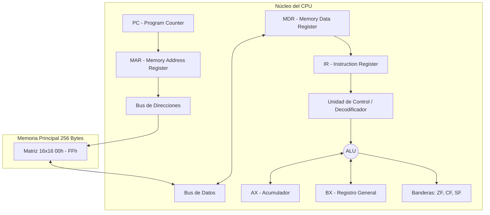

# Documentación Técnica: Simulador de CPU (Arquitectura de 8 bits) y Memoria Principal

Este documento contiene la especificación técnica completa, la arquitectura del sistema, el manual de usuario y la traza de ejecución paso a paso para el simulador de arquitectura von Neumann de 8 bits desarrollado sobre Google Sheets mediante Google Apps Script.

---

## 1. Arquitectura del Sistema

El simulador implementa una arquitectura Von Neumann clásica con bus de datos de 8 bits y un espacio de direccionamiento unificado para código y datos de 256 bytes (direcciones `00h` a `FFh`).

---

## 2. Conjunto de Instrucciones (ISA)

La tabla de la ISA define la codificación binaria/hexadecimal (Opcodes), el mnemónico formal en ensamblador, la categoría de instrucción y el impacto sobre los registros y banderas de estado.

| Opcode (Hex) | Mnemónico | Tipo | Descripción |
| :---: | :--- | :--- | :--- |
| **10** | `MOV AX, imm` | Transferencia | Carga un valor inmediato de 8 bits en el acumulador AX. |
| **12** | `MOV AX, BX` | Transferencia | Copia el contenido del registro BX al acumulador AX. |
| **14** | `LOAD AX, [dir]` | Transferencia | Carga en AX el contenido de la dirección de memoria apuntada. |
| **15** | `STORE [dir], AX`| Transferencia | Guarda el valor actual de AX en la dirección de memoria indicada. |
| **20** | `ADD AX, imm` | Aritmética | Suma un valor inmediato a AX. Afecta ZF, CF, SF. |
| **22** | `SUB AX, imm` | Aritmética | Resta un valor inmediato a AX. Afecta ZF, CF, SF. |
| **23** | `INC AX` | Aritmética | Incrementa AX en 1. Afecta ZF, CF, SF. |
| **24** | `DEC AX` | Aritmética | Decrementa AX en 1. Afecta ZF, CF, SF. |
| **25** | `CMP AX, imm` | Lógica | Compara AX con un valor. Actualiza banderas sin guardar el resultado. |
| **30** | `JMP dir` | Control | Salto incondicional a la dirección especificada (Modifica PC). |
| **31** | `JZ dir` | Control | Salta a la dirección si la bandera Zero (ZF) es 1. |
| **32** | `JNZ dir` | Control | Salta a la dirección si la bandera Zero (ZF) es 0. |
| **FF** | `HLT` | Sistema | Detiene el ciclo de reloj de la CPU. |

---

## 3. Manual de Usuario e Interfaz Gráfica

La interfaz gráfica opera directamente sobre la cuadrícula de Google Sheets mediante macros vinculadas a botones de control:

1. **RESET:** Limpia la memoria RAM (llena la matriz de 256 bytes con `00`), reinicia todos los registros (`AX`, `BX`, `PC`, `IR`, `MAR`, `MDR`) a cero y vacía el registro (log) de operaciones.
2. **LOAD PROGRAM:** Carga el programa demostrativo preensamblado directamente en la memoria RAM comenzando desde la dirección `00h`.
3. **STEP:** Ejecuta un único ciclo de reloj completo (Fetch $\rightarrow$ Decode $\rightarrow$ Execute $\rightarrow$ Store) e ilumina de forma interactiva la ruta de datos activa en la hoja.
4. **RUN:** Inicia el modo de ejecución automática continua a frecuencia constante hasta encontrar la instrucción de detención `HLT` (`FFh`).
5. **PAUSE:** Congela el reloj del procesador durante la ejecución continua, manteniendo congelados los valores actuales de los registros y la memoria RAM para inspección.

---

## 4. Análisis y Traza de Ejecución Matemática

El programa integrado realiza una cuenta regresiva comenzando en `3`, almacenando el valor actual en la memoria RAM (`80h`) durante cada iteración. Demuestra el funcionamiento de operaciones aritméticas, transferencia a RAM y saltos condicionales impulsados por banderas ALU.

### 4.1. Código en Ensamblador y Estructura en Memoria

| Dirección | Opcode / Datos | Mnemónico | Descripción |
| :---: | :---: | :--- | :--- |
| `00h` | `10 03` | `MOV AX, 03` | Inicializa el contador en 3. |
| `02h` | `15 80` | `STORE [80h], AX` | Almacena el contenido de AX en la dirección RAM 80h. |
| `04h` | `24` | `DEC AX` | Decrementa el acumulador AX en 1 unidad. |
| `05h` | `25 00` | `CMP AX, 00` | Compara AX con 0 (evalúa estado ALU). |
| `07h` | `32 02` | `JNZ 02h` | Salta a la dirección 02h si ZF == 0. |
| `09h` | `FF` | `HLT` | Detiene el ciclo de reloj del sistema. |

---

### 4.2. Traza de Ejecución Paso a Paso

**Estado Inicial del Sistema:**
* `PC = 00h`
* `AX = 00h`
* `ZF = 0`, `CF = 0`, `SF = 0`
* `RAM[80h] = 00h`

---

#### **Iteración 1**

1. **`00h: MOV AX, 03`**
   * Fetch & Decode: Se lee el Opcode `10` e inmediato `03`.
   * Ejecución: $AX \leftarrow 03$.
   * Estado: `AX = 03h`, `PC = 02h`.

2. **`02h: STORE [80h], AX`**
   * Fetch & Decode: Se lee el Opcode `15` y dirección `80h`.
   * Escritura en RAM: $RAM[80h] \leftarrow AX = 03h$.
   * Estado: `RAM[80h] = 03h`, `PC = 04h`.

3. **`04h: DEC AX`**
   * Fetch & Decode: Se lee el Opcode `24`.
   * Operación ALU: $AX \leftarrow 03 - 1 = 02$.
   * Actualización de Banderas: $AX \neq 0 \implies ZF = 0$.
   * Estado: `AX = 02h`, `ZF = 0`, `PC = 05h`.

4. **`05h: CMP AX, 00`**
   * Fetch & Decode: Se lee el Opcode `25` e inmediato `00`.
   * Operación ALU: Resta de prueba $02 - 00 = 02$ (no altera $AX$).
   * Actualización de Banderas: $ZF = 0$.
   * Estado: `AX = 02h`, `ZF = 0`, `PC = 07h`.

5. **`07h: JNZ 02h`**
   * Fetch & Decode: Se lee Opcode `32` y dirección `02h`.
   * Evaluación de Condición: ¿$ZF == 0$? **Sí** ($0 == 0$).
   * Salto: $PC \leftarrow 02h$.

---

#### **Iteración 2**

1. **`02h: STORE [80h], AX`**
   * Fetch & Decode: Se lee Opcode `15 80`.
   * Escritura en RAM: $RAM[80h] \leftarrow AX = 02h$.
   * Estado: `RAM[80h] = 02h`, `PC = 04h`.

2. **`04h: DEC AX`**
   * Fetch & Decode: Se lee Opcode `24`.
   * Operación ALU: $AX \leftarrow 02 - 1 = 01$.
   * Banderas: $AX \neq 0 \implies ZF = 0$.
   * Estado: `AX = 01h`, `ZF = 0`, `PC = 05h`.

3. **`05h: CMP AX, 00`**
   * Fetch & Decode: Se lee Opcode `25 00`.
   * Operación ALU: Resta de prueba $01 - 00 = 01$.
   * Banderas: $ZF = 0$.
   * Estado: `AX = 01h`, `ZF = 0`, `PC = 07h`.

4. **`07h: JNZ 02h`**
   * Fetch & Decode: Se lee Opcode `32 02`.
   * Evaluación de Condición: ¿$ZF == 0$? **Sí** ($0 == 0$).
   * Salto: $PC \leftarrow 02h$.

---

#### **Iteración 3**

1. **`02h: STORE [80h], AX`**
   * Fetch & Decode: Se lee Opcode `15 80`.
   * Escritura en RAM: $RAM[80h] \leftarrow AX = 01h$.
   * Estado: `RAM[80h] = 01h`, `PC = 04h`.

2. **`04h: DEC AX`**
   * Fetch & Decode: Se lee Opcode `24`.
   * Operación ALU: $AX \leftarrow 01 - 1 = 00$.
   * Actualización de Banderas: El resultado es cero $\implies ZF = 1$.
   * Estado: `AX = 00h`, `ZF = 1`, `PC = 05h`.

3. **`05h: CMP AX, 00`**
   * Fetch & Decode: Se lee Opcode `25 00`.
   * Operación ALU: Resta de prueba $00 - 00 = 00$.
   * Banderas: $ZF = 1$.
   * Estado: `AX = 00h`, `ZF = 1`, `PC = 07h`.

4. **`07h: JNZ 02h`**
   * Fetch & Decode: Se lee Opcode `32 02`.
   * Evaluación de Condición: Requiere $ZF == 0$, pero actualmente $ZF = 1$. **Condición Falsa**.
   * Salto: Se ignora la bifurcación. El contador de programa avanza secuencialmente: $PC \leftarrow 09h$.

---

#### **Finalización del Programa**

1. **`09h: HLT`**
   * Fetch & Decode: Se lee el Opcode `FF`.
   * Acción: Se interrumpe el generador de reloj de la CPU y finaliza la simulación.

---

### **5. Estado Final de la Máquina**

* **Program Counter (`PC`):** `09h` (Ubicado en la instrucción de parada `HLT`)
* **Acumulador (`AX`):** `00h` (La cuenta regresiva ha concluido)
* **Zero Flag (`ZF`):** `1` (La ALU registró un valor nulo)
* **RAM de Datos (`80h`):** `01h` (Última actualización válida en memoria antes de que AX alcanzara 0)